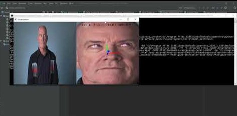

# Computer Pointer Controller

## Introduction

This project is one of three projects of the Intel Edge AI IoT Nanodegree Program. The project makes use of Intel's pre-trained models to build a Computer Pointer Controller app that controls the movement of the mouse pointers with the direction of a human eyes as well the estimation pose of head provided by an input video or webcam.

| DETAILS             |             |
|-----------------------|---------------|
| **Programming Language** |  Python 3.6 |
| **OpenVino Version** |  2020.2.120 |
| **Models Required** |face-detection-adas-binary-0001<br /> landmarks-regression-retail-0009 <br /> head-pose-estimation-adas-0001 <br /> gaze-estimation-adas-0002|
| **Hardware Used** |  Intel Core i3 5th gen|
| **Environment Used** |  Windows|



## Project Set Up and Installation

### Directory Structure
```

├── bin
│   └──  demo.mp4
├── models
    └──  intel
        ├── face-detection-adas-binary-0001
        ├── gaze-estimation-adas-0002
        ├── head-pose-estimation-adas-0001
        ├── landmarks-regression-retail-0009
└── src
    ├── app.py
    ├── face_detection.py
    ├── facial_landmarks_detection.py
    ├── gaze_estimation.py
    ├── head_pose_estimation.py
    ├── input_feeder.py
    └── mouse_controller.py
├── README.md
├── requirements.txt

```

### Setup

#### Install Intel® Distribution of OpenVINO™ toolkit
See this [guide](https://docs.openvinotoolkit.org/latest/) for installing openvino.

#### Install dependencies using the command:
```
pip install -r requirements.txt
```

#### Create a virtual environment for the project:
* In which ever directory you are, create a virtualenv there
```
virtualenv myenv
```
* To activate the directory
```
myenv\Scripts\activate
```

#### Initialize the OpenVINO environment:
```
cd C:\Program Files (x86)\IntelSWTools\openvino\bin\
```
```
setupvars.bat
```

#### Downloading the required model files

- [Face Detection Model](https://docs.openvinotoolkit.org/latest/_models_intel_face_detection_adas_binary_0001_description_face_detection_adas_binary_0001.html)
- [Facial Landmarks Detection Model](https://docs.openvinotoolkit.org/latest/_models_intel_landmarks_regression_retail_0009_description_landmarks_regression_retail_0009.html)
- [Head Pose Estimation Model](https://docs.openvinotoolkit.org/latest/_models_intel_head_pose_estimation_adas_0001_description_head_pose_estimation_adas_0001.html)
- [Gaze Estimation Model](https://docs.openvinotoolkit.org/latest/_models_intel_gaze_estimation_adas_0002_description_gaze_estimation_adas_0002.html)

How to download the models using the `model downloader`.
```
cd C:\Program Files (x86)\IntelSWTools\openvino\deployment_tools\open_model_zoo\tools\downloader
```
* Face Detection Model
```
downloader.py --name face-detection-adas-binary-0001 -o /<preferred_directory>
```
* Facial Landmarks Detection Model
```
downloader.py --name landmarks-regression-retail-0009 -o /<preferred_directory>
```
* Head Pose Estimation Model
```
downloader.py --name head-pose-estimation-adas-0001 -o /<preferred_directory>
```
* Gaze Estimation Model
```
downloader.py --name gaze-estimation-adas-0002 -o /<preferred_directory>
```

## Demo

To run the model, open a new terminal and run the following command:
1. Change to project directory
```
cd <project-directory>/starter
```
2. Run the app.py

* Running the app on CPU
```
python src\app.py -fd models\intel\face-detection-adas-binary-0001\FP32-INT1\face-detection-adas-binary-0001 \
                  -fl models\intel\landmarks-regression-retail-0009\FP16\landmarks-regression-retail-0009 \
                  -hp models\intel\head-pose-estimation-adas-0001\FP16\head-pose-estimation-adas-0001 \
                  -ge models\intel\gaze-estimation-adas-0002\FP16\gaze-estimation-adas-0002 \ 
                  -i bin\demo.mp4 
```
* Running the app on GPU
```
python src\app.py -fd models\intel\face-detection-adas-binary-0001\FP32-INT1\face-detection-adas-binary-0001 \
                  -fl models\intel\landmarks-regression-retail-0009\FP16\landmarks-regression-retail-0009 \
                  -hp models\intel\head-pose-estimation-adas-0001\FP16\head-pose-estimation-adas-0001 \
                  -ge models\intel\gaze-estimation-adas-0002\FP16\gaze-estimation-adas-0002 \ 
                  -i bin\demo.mp4
                  -d  GPU
```
* Running the app on FPGA
```
python src\app.py -fd models\intel\face-detection-adas-binary-0001\FP32-INT1\face-detection-adas-binary-0001 \
                  -fl models\intel\landmarks-regression-retail-0009\FP16\landmarks-regression-retail-0009 \
                  -hp models\intel\head-pose-estimation-adas-0001\FP16\head-pose-estimation-adas-0001 \
                  -ge models\intel\gaze-estimation-adas-0002\FP16\gaze-estimation-adas-0002 \ 
                  -i bin\demo.mp4
                  -d HETERO:CPU,FPGA 
```
* Running the app on VPU
```
python src\app.py -fd models\intel\face-detection-adas-binary-0001\FP32-INT1\face-detection-adas-binary-0001 \
                  -fl models\intel\landmarks-regression-retail-0009\FP16\landmarks-regression-retail-0009 \
                  -hp models\intel\head-pose-estimation-adas-0001\FP16\head-pose-estimation-adas-0001 \
                  -ge models\intel\gaze-estimation-adas-0002\FP16\gaze-estimation-adas-0002 \ 
                  -i bin\demo.mp4
                  -d MYRIAD 
```

## Documentation

```
usage: app.py [-h] -fd FDMODEL -fl FLMODEL -hp HPMODEL -ge GEMODEL -i
               INPUT [-l CPU_EXTENSION] [-d DEVICE] [-pt PROB_THRESHOLD]

optional arguments:
  -h, --help            show this help message and exit
  -fd FDMODEL, --face_detection_model FDMODEL
                        Path to face detection model files.
  -fl FLMODEL, --facial_landmarks_model FLMODEL
                        Path to facial landmarks model files.
  -hp HPMODEL, --head_pose_model HPMODEL
                        Path to head pose estimation model files.
  -ge GEMODEL, --gaze_estimation_model GEMODEL
                        Path to gaze estimation model files.
  -i INPUT, --input INPUT
                        Path video file or CAM to use camera.
  -l CPU_EXTENSION, --cpu_extension CPU_EXTENSION
                        MKLDNN (CPU)-targeted custom layers.Absolute path to a
                        shared library with the kernels impl.
  -d DEVICE, --device DEVICE
                        Specify the target device to infer on: CPU, GPU, FPGA
                        or MYRIAD is acceptable. Sample will look for a
                        suitable plugin for device specified (CPU by default)
  -pt PROB_THRESHOLD, --prob_threshold PROB_THRESHOLD
                        Probability threshold for detections filtering(0.5 by
                        default)

```

## Benchmarks

So far, app has been run on a single device - CPU:

| Factor/Model       | Face Detection   | Landmarks Detetion        | Headpose Estimation | Gaze Estimation |
|--------------------|---------------|-----------|-------------|-----------|
|Load Time FP32      |  392ms        | 296ms     | 132ms       | 144ms     |
|Load Time FP16      |  NA           | 452ms     | 327ms       | 250ms     |  
||||||
|Inference Time FP32 | 80.5ms         | 10.5ms     | 11.1ms       | 12.3ms     |
|Inference Time FP16 | NA            | 10.6ms     | 10.2ms       | 10.4ms     |
||||||

## Results

* The face detection model takes the most time to load with FP32 precision.
* Expectedly, the accuracy of the models descreases with decreasing precision.
* On further test, app should perform better on GPU. (coming soon).

### Edge Cases

* If there are multiple faces in input video, app is run on the first detected face. Moving forward, app can be designed to identify a particular face to to control the mouse pointer.
