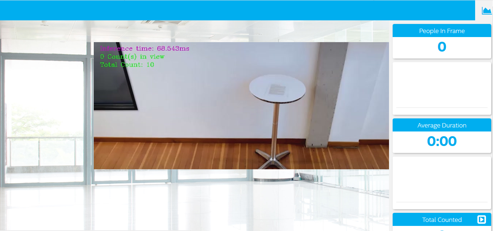
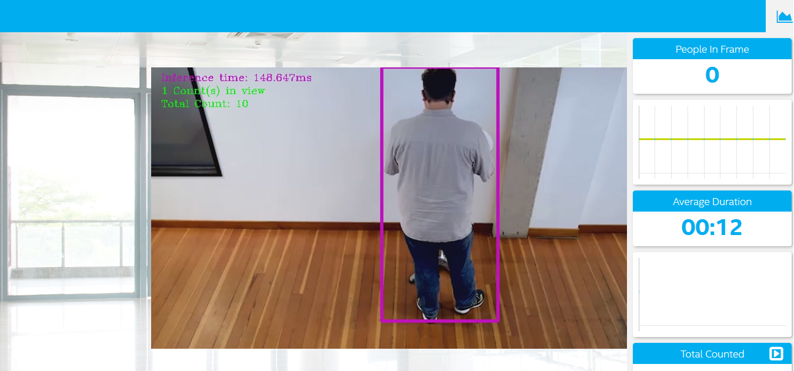
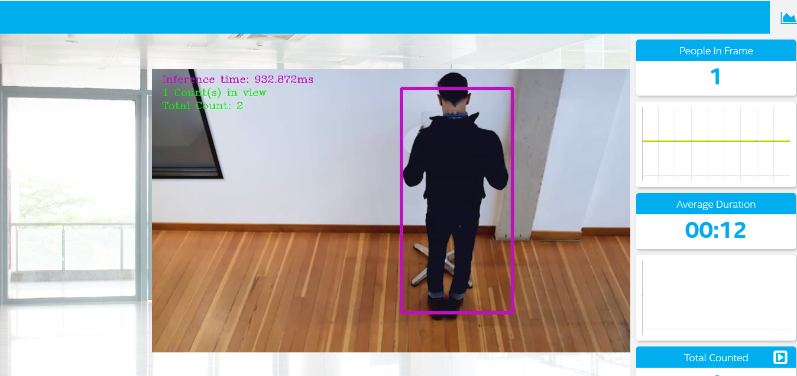

# Project Write-Up
This project was one of the requirements off the Intel® Edge AI for IoT Developers Nanodegree program with Udacity. Here, I developed an IoT app that could keep tabs on the number of persons in a particular location. This write up contains the project workflow.

## Explaining Custom Layers

* Custom Layers are one of many ways to handle unsupported layers. OpenVINO™ toolkit supports neural network model layers in different frameworks. 
* List of supported layers differs for each framework. If there exist any layer that is not not included in the list of known layers, the model optimizer tags it as a custom layer. 
* More often than not, the custom layer would not be required.
* Here is the link to the [framework layers supported](https://docs.openvinotoolkit.org/latest/_docs_MO_DG_prepare_model_Supported_Frameworks_Layers.html) by the model optimizer in openvino.

### Process Behind Converting Supported Layers
* If after confirming the model topology contain layers that are not in the supported layer list, there'd need to be changes at the Model Optimizer as well as at the Inference Engine.

* At the Model Optimizer level, you declare the custom layer and its attributes and parameters.
    1. Custom Layer Attribute Extraction - an extractor to identify the custom lyer operation and extract parameters for each instance of the custom layer.
    2. Custom Layer Implementation - the custom layer operation which specifies the attributes that are supported by the custom layer and computes the output shape for each instance of the custom layer from its parameters. 
    
* At the Inference level, you would implement the logic for the custom layers.
    1. Custom Layer Immplementation (CPU)
        Language: C++
        Final Product: Compiled binary file (.dll or .so)
    2. Custom Layer Implementation (GPU)
        Language: OpenCL™ (C-based)
        Final Product: .cl & .xml files
    3. Custom Layer Implementation (FPGA)
        Language: OpenCL™ (C-based)
        Final Product: bitstream (.aocx file)

### Potential Reasons For Handling Custom Layers

* Custom layers are essential for successful conversion of pre-trained models from supported framework layers to intermediate representation layers through the Model Optimizer.
* Likewise at the inference level, custom layer logic are necessary to load the IR-formatted model into the user-defined hardware.


## MODEL SELECTION

Models used during the project were selected from the [Tensorflow Detection Model Zoo](https://github.com/tensorflow/models/blob/master/research/object_detection/g3doc/detection_model_zoo.md).

### MODEL 1: SSD MobileNet V2 Coco

Downloaded to workspace with the following command:
```
wget http://download.tensorflow.org/models/object_detection/ssd_mobilenet_v2_coco_2018_03_29.tar.gz
```

Extract downloaded file with the following command:
```
tar -xvf ssd_mobilenet_v2_coco_2018_03_29.tar.gz
```

Converted the model to Intermediate Representation with the following command:
```
python3 /opt/intel/openvino/deployment_tools/model_optimizer/mo.py --input_model ssd_mobilenet_v2_coco_2018_03_29/frozen_inference_graph.pb --tensorflow_use_custom_operations_config /opt/intel/openvino/deployment_tools/model_optimizer/extensions/front/tf/ssd_v2_support.json --tensorflow_object_detection_api_pipeline_config ssd_mobilenet_v2_coco_2018_03_29/pipeline.config --reverse_input_channels 
```

### MODEL 2: SSD Inception V2 Coco

Downloaded to workspace with the following command:
```
wget http://download.tensorflow.org/models/object_detection/ssd_inception_v2_coco_2018_01_28.tar.gz
```

Extract downloaded file with the following command:
```
tar -xvf ssd_inception_v2_coco_2018_01_28.tar.gz
```

Converted the model to Intermediate Representation with the following command:
```
python3 /opt/intel/openvino/deployment_tools/model_optimizer/mo_tf.py --input_model ssd_inception_v2_coco_2018_01_28/frozen_inference_graph.pb --tensorflow_use_custom_operations_config /opt/intel/openvino/deployment_tools/model_optimizer/extensions/front/tf/ssd_v2_support.json --tensorflow_object_detection_api_pipeline_config ssd_inception_v2_coco_2018_01_28/pipeline.config --reverse_input_channels
```

### MODEL 3: Faster RCNN Inception V2 Coco

Downloaded to workspace with the following command:
```
wget http://download.tensorflow.org/models/object_detection/faster_rcnn_inception_v2_coco_2018_01_28.tar.gz
```

Extract downloaded file with the following command:
```
tar -xvf faster_rcnn_inception_v2_coco_2018_01_28.tar.gz
```

Converted the model to Intermediate Representation with the following command:
```
python3 /opt/intel/openvino/deployment_tools/model_optimizer/mo_tf.py --input_model faster_rcnn_inception_v2_coco_2018_01_28/frozen_inference_graph.pb --tensorflow_use_custom_operations_config /opt/intel/openvino/deployment_tools/model_optimizer/extensions/front/tf/faster_rcnn_support.json --tensorflow_object_detection_api_pipeline_config faster_rcnn_inception_v2_coco_2018_01_28/pipeline.config --reverse_input_channels
```

## Comparing Model Performance

The methods implemented to compare models before and after conversion to Intermediate Representations include:

* Model size
* Inference time
* Accuracy

### Model Size

| |SSD MobileNet V2|SSD Inception V2|Faster RCNN Inception V2|
|-|-|-|-|
|Pre-Conversion|66.5 MB|97.3 MB|54.5 MB|
|Post-Conversion|64.3 MB|95.4 MB|50.8 MB|

### Inference Time

| |SSD MobileNet V2|SSD Inception V2|Faster RCNN Inception V2|
|-|-|-|-|
|Pre-Conversion|60 ms|140 ms|881 ms|
|Post-Conversion|70 ms|150 ms|934 ms|

### Accuracy

With respect to accuracy, quite expectedly, the SSD MobileNet V2 model didn't fare well. The MobileNet V2 model is known to perform better on mobile devices as compared to desktop CPU/GPU. Though the model has its ups in speed and size, but, it failed to rightly identify persons. 

Likewise, the SSD Inception model could not identify correctly. However, it reported a higher inference time compared to the SSD MobileNet V2 model.

The Faster RCNN Inception V2 model, which happened to be the final trial, proved efficacious. Though, running on an Intel® Core i3-5005U @2.00 GHz, it's stunted speed was anticipated. However, it's accuracy was well over 90% as it correctly identified all persons as well as published accurate statistics over the server.

The following are images from each model:

<figure align="center">
    
    <figcaption>Fig 1 - SSD MobileNet V2</figcaption>
</figure>

<figure align="center">
    
    <figcaption>Fig 2 - SSD Inception V2</figcaption>
</figure>

<figure align="center">
    
    <figcaption>Fig 3 - Faster RCNN Inception V2</figcaption>
</figure>

## Assess Model Use Cases

### Potential Use Cases of the People Counter App

* Access restriction to private locations - For secure locations where valuables, records, and documents are stored, the person counter app could be employed. Locations such as bank vaults, museums, are good examples where contents from theft, unauthorized use, and other threats, are controlled and supervised.

* Control number of persons in a particular location - The person counter app could be significantly applied during the ongoing pandemic. Rightfully ensuring that the WHO's advice on crowd control and social distancing is executed.

* Targeted Marketing - For marketers who hope to advertise their goods and services via billboard, the person counter app comes in handy. Here, the app stragetically identifies locations that confines the largest crowd.

* Safety - Case in point, a fire scenario at a factory. Usually, a roll call is done at the muster point to confirm saftey of staff. Here, the app could easily identify number of persons still in danger in real time. Thus, in emergency situations, the counter app could prove beneficial.

* Time Monitoring Systems - App could beneficial for services that require queues. A case study: ATMs. Time of each user could easily be monitored. If user spends so much time on the machine, an alarm can be activated to warn user.

Each of these use cases would be useful because they contribute to the safety of lives and valuable properties, as well as creating a possibility for business owners to make more money.

## Assess Effects on End User Needs

End users of deloyed edge models might need to be aware that these systems are not 100% accurate and do not fare well when subjected to certain conditions. Lighting, model accuracy, and camera focal length/image size have different effects on a
deployed edge model. 
It should be known that at the time of model generation, models were built off various instances/occurrences. And as such, would only be able to detect accurately if the circumstance matches or closely relates to one that has been used during model generation. 
For example, if a model was built off perfectly lighted scenarios, there is a high chance of it failing when exposed to a low lighting situation. 
Also, consider a bank vault theft. Suppose the installed camera focal length/image size at the vault does not match or fare well enough to identify/detect the person, it results in a huge loss for the bank. This shows how important the accuracy of edge application needs to be at all times.
For this reason, it is advised that edge models be built and tested on diverse conditions that meet end users need.

## References

* [OpenVINO Toolkit API Classes](https://docs.openvinotoolkit.org/2019_R3/ie_python_api.html)
* [Tensorflow Detection Model Zoo](https://github.com/tensorflow/models/blob/master/research/object_detection/g3doc/detection_model_zoo.md)
* [Intel IoT Devkit](https://github.com/intel-iot-devkit/people-counter-python)